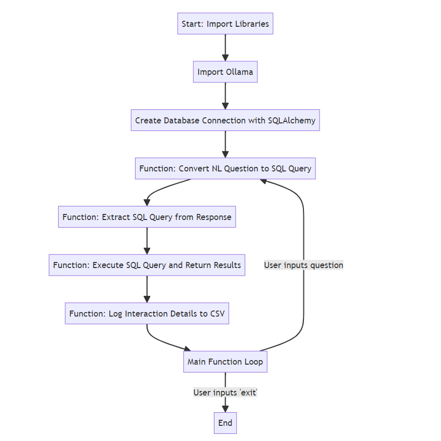

# Text to SQL Chatbot Backend

This project is focused on building the backend for a chatbot that translates natural language questions into SQL queries, utilizing large language models (LLMs). 
The core of this system is powered by the Ollama tool, which facilitates access to LLMs **locally**.

## How It Works

The backend system follows a structured flow to convert text inputs to SQL queries, execute these queries against a database, and log the interactions for further analysis.

## Features

- **Import Libraries**: The necessary libraries are imported to handle various aspects of the application.
- **Import Ollama**: Ollama is imported for accessing LLM models locally for query generation.
- **Create Database Connection with SQLAlchemy**: A connection to the database is established to communicate and execute SQL queries.
- **Convert NL Question to SQL Query**: A function that takes natural language questions and converts them to SQL queries using the Ollama model.
- **Extract SQL Query from Response**: A function that extracts the SQL query from the LLM's response using regular expressions.
- **Execute SQL Query and Return Results**: This function takes the generated SQL query, executes it, and returns the fetched results.
- **Log Interaction Details to CSV**: Logs interaction details including timestamp, user question, generated SQL query, and response to a CSV file.

## Usage

The main function of the application is the entry point. It prompts the user for questions about the database, processes these questions to generate and execute SQL queries, and logs the interactions. The user can exit the loop by typing 'exit'.

